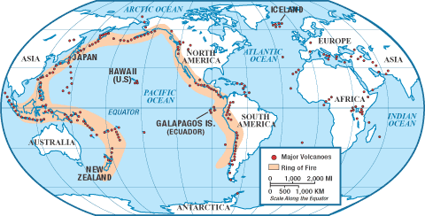

[This assignment is for ETC5521 Assignment 1 by Team `r rmarkdown::metadata$team` comprising of `r knitr::combine_words(rmarkdown::metadata$author)`.]{style="color:#006DAE;"}

```{r setup, include = FALSE}
knitr::opts_chunk$set(echo = FALSE, 
                      warning = FALSE,
                      message = FALSE)
library(tidyverse)
library(knitr)
library(kableExtra)
library(gridExtra)
library(sf)
```


```{r getting-data}
# Get the Data
volcano <- readr::read_csv('https://raw.githubusercontent.com/rfordatascience/tidytuesday/master/data/2020/2020-05-12/volcano.csv')
eruptions <- readr::read_csv('https://raw.githubusercontent.com/rfordatascience/tidytuesday/master/data/2020/2020-05-12/eruptions.csv')
events <- readr::read_csv('https://raw.githubusercontent.com/rfordatascience/tidytuesday/master/data/2020/2020-05-12/events.csv')
tree_rings <- readr::read_csv('https://raw.githubusercontent.com/rfordatascience/tidytuesday/master/data/2020/2020-05-12/tree_rings.csv')
sulfur <- readr::read_csv('https://raw.githubusercontent.com/rfordatascience/tidytuesday/master/data/2020/2020-05-12/sulfur.csv')

# tectonic plates coordinates
rof <- read_csv("all.csv")
```


# Introduction and motivation

Volcanoes are nature's explosive land forms and yet one of the most beautiful. We chanced upon data set released by `TidyTuesday` which is probably one of if not the most comprehensive data set to learn more about volcanoes. 

Volcanoes date back to hundreds and thousands of years ago. This data exploration takes a closer look at the more recent active volcanoes around. 

We start with a brief introduction into the world of volcanoes, then visit the interaction between volcano & humans and finally looking into the characteristics of volcano.

 
# Data description

The data source is from [The Smithsonian Institution](https://volcano.si.edu/). The data is available, and cleaned, downloadable from [tidytuesday github](https://github.com/rfordatascience/tidytuesday/blob/master/data/2020/2020-05-12/readme.md). Cleaning script is also supplied.


Data provided contains 5 linked data sets, each with looking at a particular aspect of volcano:  

- `volcano`: Provides information on 958 volcanoes such as
  - its metadata: volcano name, type, country location, evidence category, longitude and latitude
  - technical details: major & minor rocks, tectonic settings
  - distance from nearest population (km)
  
- `eruptions`: Details eruptions occured since Holecene (dubbed time since the end of "ice age") period (11,345 years ago) to present. Details include  
  - VEI (volcano explosivity index), date of eruption, eruption category/type, evidence method

- `events`: any event that occur at the volcanoes documented.
  - such as explosion, dome/cone formation, fatalities, evacuation, loud audible noises among others.

- `tree_ring`: Tree rings were used as a climate proxy. In study of effects on volcanoes on climate change, researchers matched effects of eruptions to tree ring records. 

- `sulfur`
  - Provide information on sulphur detected from 500.CE to 706.CE

# Analysis and findings

## World Of Active Volcanoes

```{r volcano, include = FALSE}
#types of volcanoes
volcano %>% 
  count(primary_volcano_type) 

# categorize volcanoes into 4 main types
volcano_types <- volcano %>% 
  mutate(primary_volcano_type = case_when(
    str_detect(primary_volcano_type, "Stratovolcano") ~ "Stratovolcano",
    str_detect(primary_volcano_type, "Shield") ~ "Shield",
    str_detect(primary_volcano_type, "Caldera") ~ "Caldera",
    TRUE ~ "Other"
  ))

unique(volcano_types$primary_volcano_type)
```

### World Map of Active Volcanoes erupt

```{r volcano-erupted, include = FALSE}
# join only volcanoes that erupted
volcano_erupted <-inner_join(volcano_types, eruptions) %>%
  # select relevant variables
  select(volcano_name, vei, start_year, end_year, last_eruption_year, primary_volcano_type, country, latitude, longitude, elevation, evidence_category, population_within_5_km, population_within_10_km, population_within_30_km, population_within_100_km) %>% 
# concatenate country & volcano name
  mutate(volcano = str_c(volcano_name, country, sep = " -"), .keep = "all") 

# summarize volcano erupted; keeping all columns
volcano_erupted <- volcano_erupted %>% 
  group_by(volcano) %>%
  # find count (i.e. no. of times volcano erupted)
  mutate(n = n()) %>%  
  distinct(volcano, 
           .keep_all = TRUE) %>% 
  ungroup()
```


```{r}
plate <- unique(rof$plate) %>% 
  tibble(plate = .)

# convert to sf object & split into 2 polygons (to prevent across dateline)
plates <- map(.x = plate$plate,
    .f = function(x){
      st_polygon(x = list(as.matrix(rof %>% filter(plate == x) %>%  select(lon, lat)))) %>% 
  st_wrap_dateline()
    }) 

# convert polygons back to dataframe
plates2 <- lapply(seq_along(plates), 
                 function(i) as.data.frame(plates[[i]][[1]]) %>% 
                   mutate(group = i)) %>%
  data.table::rbindlist() %>% 
  rename(lon = V1, lat = V2)
```


```{r}
world <- map_data("world")

# add continent coordinates
continent_coord <- tibble(id = c("Africa", "Asia", "Europe", "North America", "Oceania", "South America"),
                          long = c(15, 80, 20, -100, 150, -60),
                          lat = c(15, 35, 50, 40, -25, -15),
                          stringsAsFactors = F)

# add ring of fire coordinates
ring_of_fire <- tibble(id = c("Ring of Fire", "Ring of Fire"), 
                    long = c(180, -180),
                    lat = c(40, 40))

# ----- plot world map
world %>% 
  ggplot() +
  geom_map(map = world,
           aes(x = long, y = lat,
               map_id = region)) +
  geom_point(data = volcano_erupted,
             aes(x = longitude, y = latitude,
                 shape = primary_volcano_type),
                 colour = "red",
                 size = 1.5) +
  theme(legend.position = "bottom") +
  geom_polygon(data = plates2,
               aes(x = lon,
                   y = lat,
                   group = group),
               fill = NA,
               colour = "dark green",
               size = 1.5) +
  # add continent text
  geom_text(data = continent_coord,
            aes(x = long, 
                y = lat,
                label = id),
            colour = "blue",
            size = 5) +
  geom_text(data = ring_of_fire,
            aes(x = long, 
                y = lat,
                label = id),
            colour = "red") +
  # remove legends
  guides(colour = FALSE,
         size = FALSE,
         alpha = FALSE) +
  ggtitle("Active Volcanoes, Tectonic Plates and The Ring of Fire")
  

  
```

Above shows the world map of Active Volcanoes with tectonic plate boundaries overlaid. 

We noted that most of the volcanoes lie along the Pacific Ocean and found that was dubbed the Ring of Fire. Interestingly, this is where 75% of the World's Volcanoes are situated and 90% of active ones!

To achieve the map, we could not just plot the tectonic boundaries as the polygons stretch across the world map (looking like they are at opposite ends of the world when in fact they are side by side since the globe is round while ggplot is 2D). So, we split the tectonic plates at the prime meridian (x-intercept where long = 0) - was helped by a helpful member at [StackOverflow](https://stackoverflow.com/questions/63591697/how-to-split-tectonic-plate-boundary-polygon-in-a-way-to-prevent-line-across-the/63593236?noredirect=1#comment112479435_63593236)

```{r}
# recenter world map

```
- Graphics above shows the ring of fire that is found along pacific coast

## The interaction between volcanoes and humans - How worried should you be about volcanoes?

### population around volcanoes
```{r}
volcano_erupted %>% 
  summarize(mean_5km = summary(population_within_5_km),
            mean_10km = summary(population_within_10_km),
            mean_30km = summary(population_within_30_km),
            mean_100km = summary(population_within_100_km))

volcano_population <- volcano_erupted %>% 
  mutate(no_of_people_5km = case_when(population_within_5_km <= 100 ~ "<= 100", 
                                  population_within_5_km >= 101 & population_within_5_km <= 1000 ~ "101-1,000",
                                  population_within_5_km > 1000 & population_within_5_km <= 10000 ~ "1,001-10,000",
                                  population_within_5_km > 10000 & population_within_5_km <= 100000 ~ "10,000-100,000",
                                  population_within_5_km > 100000 & population_within_5_km <= 1000000 ~ "100,001-1,000,000",
                                  population_within_5_km > 1000000 ~ "> 1,000,000")) 

volcano_population <- volcano_population %>% 
  mutate(no_of_people_10km = case_when(population_within_10_km <= 100 ~ "<= 100", 
                                  population_within_10_km >= 101 & population_within_10_km <= 1000 ~ "101-1,000",
                                  population_within_10_km > 1000 & population_within_10_km <= 10000 ~ "1,001-10,000",
                                  population_within_10_km > 10000 & population_within_10_km <= 100000 ~ "10,000-100,000",
                                  population_within_10_km > 100000 & population_within_10_km <= 1000000 ~ "100,001-1,000,000",
                                  population_within_10_km > 1000000 ~ "> 1,000,000")) 


volcano_population <- volcano_population %>% 
  mutate(no_of_people_30km = case_when(population_within_30_km <= 100 ~ "<= 100", 
                                  population_within_30_km >= 101 & population_within_30_km <= 1000 ~ "101-1,000",
                                  population_within_30_km > 1000 & population_within_30_km <= 10000 ~ "1,001-10,000",
                                  population_within_30_km > 10000 & population_within_30_km <= 100000 ~ "10,000-100,000",
                                  population_within_30_km > 100000 & population_within_30_km <= 1000000 ~ "100,001-1,000,000",
                                  population_within_30_km > 1000000 ~ "> 1,000,000")) 

volcano_population <- volcano_population %>% 
  mutate(no_of_people_100km = case_when(population_within_100_km <= 100 ~ "<= 100", 
                                  population_within_100_km >= 101 & population_within_100_km <= 1000 ~ "101-1,000",
                                  population_within_100_km > 1000 & population_within_100_km <= 10000 ~ "1,001-10,000",
                                  population_within_100_km > 10000 & population_within_100_km <= 100000 ~ "10,000-100,000",
                                  population_within_100_km > 100000 & population_within_100_km <= 1000000 ~ "100,001-1,000,000",
                                  population_within_100_km > 1000000 ~ "> 1,000,000")) 

volcano_population_long <- volcano_population %>% 
  pivot_longer(cols = no_of_people_5km:no_of_people_100km,
               names_to = "category",
               values_to = "no_of_people") %>% 
  mutate(no_of_people = factor(no_of_people, levels = c("<= 100", "101-1,000", "1,001-10,000", "10,000-100,000", "100,001-1,000,000", "> 1,000,000")))

volcano_population_long %>% 
  group_by(category) %>% 
  ggplot() +
  geom_bar(aes(x = as.factor(no_of_people))) +
  facet_wrap(~category, ncol = 1) +
  coord_flip() +
  ggtitle("number of people within 5km, 10km, 30km and 100km") +
  ylab("categories (number of people)") +
  xlab("count")
```

There is no fixed safety risk zones as volcanoes are unpredictable. However, it is said around 1km for small/medium sized eruptions(VEI = 1-2) is relatively safe as long as volcanic projectiles do not fall in that area. Given this, most volcanoes are less than 5km from a population of people.

### World map with number of eruptions in each country
```{r}
# clean volcano$country to match world data set
volcano_country <- volcano_erupted %>% 
  mutate(country = case_when(
    country == "Armenia-Azerbaijan" ~ "Armenia",
    country == "Burma (Myanmar)" ~ "Burma",
    country %in% c("Chile-Argentina","Chile-Bolivia", "Chile-Peru") ~ "Chile",
    country == "China-North Korea" ~ "China",
    country == "Colombia-Ecuador" ~ "Colombia",
    country %in% c("DR Congo", "DR Congo-Rwanda") ~ "Democratic Republic of the Congo",
    country == "El Salvador-Guatemala" ~ "El Salvador",
    country == "Eritrea-Djibouti" ~ "Eritrea",
    country %in% c("Ethiopia-Djibouti", "Ethiopia-Kenya") ~ "Ethiopia",
    country == "Guatemala-El Salvador" ~ "Guatemala",
    country == "Japan - administered by Russia" ~ "Japan",
    country == "Mexico-Guatemala" ~ "Mexico",
    country == "North Korea-South Korea" ~ "North Korea",
    country == "Saint Kitts and Nevis" ~ "Saint Kitts",
    country == "Syria-Jordan-Saudi Arabia" ~ "Syria",
    country == "Saint Vincent and the Grenadines" ~ "Saint Vincent",
    country == "Uganda-Rwanda" ~ "Uganda",
    country == "United Kingdom" ~ "UK",
    country == "United States" ~ "USA",
    TRUE ~ country
  )) 

volcano_country_count <- volcano_country %>% 
  group_by(country) %>% 
  count() %>% 
  ungroup()

world <- map_data("world")

volcano_country_join <- left_join(world, volcano_country_count,
          by = c("region" = "country")) %>% 
  # replace n = NA to 0
  mutate(n = ifelse(is.na(n), 0, n))

# plot world map; fill number of volcanoes that erupt in each country 
volcano_country_join %>% 
  ggplot() +
  geom_map(map = volcano_country_join,
           aes(x = long, y = lat, map_id = region,
               fill = n)) +
  # plot dot points representing active volcanoes
  geom_point(data = volcano_erupted,
             aes(x = longitude, y = latitude,
                 size = population_within_5_km),
                 colour = "red")
```

### What is the probabability of a volcano erupting in each VEI category after 1812?

We filtered the data set to after 1812 where the last observed VEI 7 was recorded at Mount Tambora.

```{r}
# filter eruptions; to after 1812: eruption of Mount Tambora
eruptions_1812 <- eruptions %>% 
  filter(start_year >= 1812) 

# see lag; between last eruption to next
eruptions_1812 <- eruptions_1812 %>% 
  arrange(start_year, volcano_name) %>%  
  group_by(volcano_name) %>% 
  # find year between eruptions = year of eruption + (time between last and start of eruption)
  mutate(lag_year = start_year + (lag(start_year) - start_year))
```


```{r}
library(ggridges)
eruptions_1812_pdf <- eruptions_1812 %>% 
  filter(!is.na(vei)) %>% 
  group_by(volcano_name, vei) %>% 
  mutate(no_of_eruptions = n(),
         vei = factor(vei, levels = c(0, 1, 2,3 ,4, 5, 6, 7))) 

eruptions_1812_pdf %>% 
  ggplot() +
  stat_density_ridges(aes(y = factor(vei, levels = c(0,1,2,3,4,5,6,7)),
                          x = no_of_eruptions,
                          fill = vei),
                      # colour median line & adjust size
                      quantile_lines = TRUE,
                      vline_color = "red",
                      vline_size = 1.5,
                      quantiles = 0.5,
                      # add jittered points
                      jittered_points = TRUE,
                      alpha = 0.7,
                      position = "raincloud") +
  scale_x_continuous(breaks = seq(from = 0, to = 70, by = 5 )) +
  ylab("VEI") +
  xlab("number of eruptions") +
  ggtitle("Probability density function of eruptions in each VEI category")

eruptions_1812_pdf %>% 
  group_by(vei) %>% 
  summarise(min = min(no_of_eruptions),
            `1Q` = quantile(no_of_eruptions, 0.25),
            median = median(no_of_eruptions),
            `3Q` = quantile(no_of_eruptions, 0.75),
            max = max(no_of_eruptions)) %>% 
  kable() %>% 
  kable_styling(bootstrap_options = c("striped", "hover"))
```

### How Frequent does volcanoes erupt?
```{r}
# Plot all volcanoes that erupted more than once
eruptions_1812 %>% 
  # filter volcanoes; with only 1 eruption i.e. NA for lag_year variable
  filter(!is.na(lag_year)) %>% 
  ggplot() +
  geom_tile(aes(x = volcano_name,
                 y = lag_year),
            fill = "red",
            size = 5) +
  coord_flip() +
  # facet by VEI
  facet_wrap(~vei)
```


```{r}
# plot top 10 volcanoes with maximum frequency
```


# References
